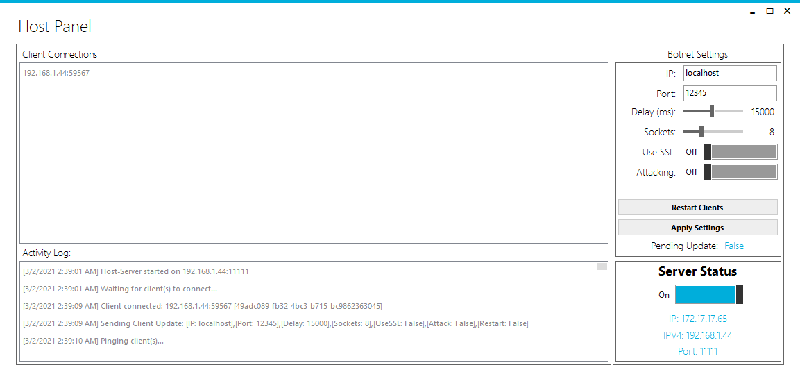
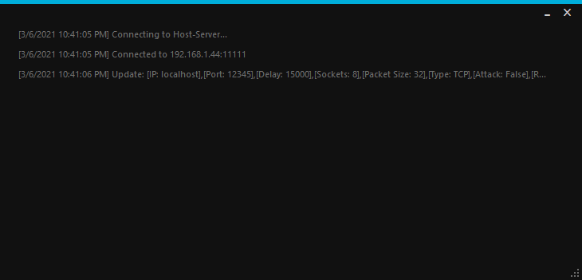

# CS 376 - Cryptography & Network Security - Project - BOTNET

Prototype Screenshots:

TODO:
1. Ensure DDOS functionality is working correctly
2. Ensure multiple client connections will work simultaneously
3. Improve Performance/Efficiency
4. Implement User Settings functionality (xml file that saves/loads on launch/exit)
